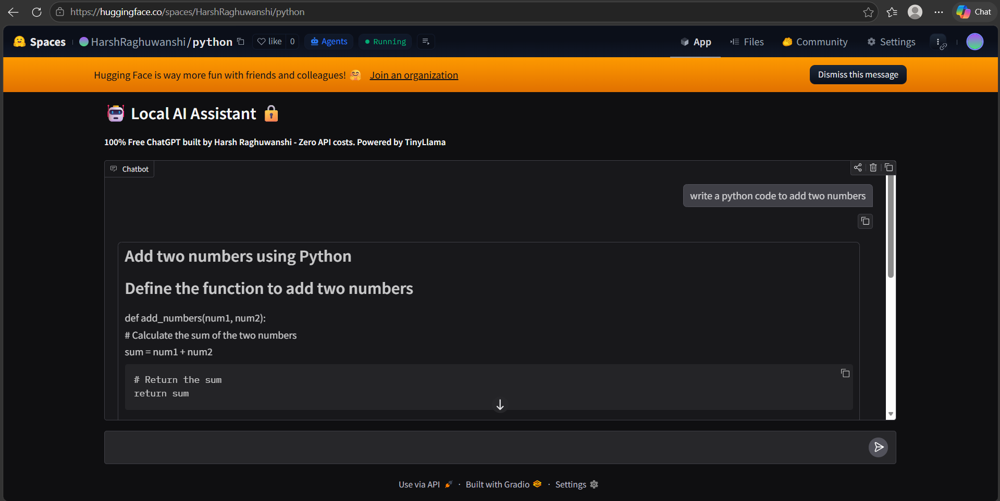

# JARVIS Lite ☁️

### 100% Free AI Assistant That Runs Anywhere

Cloud-hosted version of JARVIS using TinyLlama 1.1B. No API keys, no GPU, no cost. Always online.

### 🚀 Live Demo
https://huggingface.co/spaces/HarshRaghuwanshi/python



### Why this is cool:
- **Zero API costs** - no OpenAI key needed
- **Always online** - hosted free on HF Spaces  
- **Full privacy** - your data never leaves the container
- **Runs on CPU** - works anywhere, no GPU needed

### Tech Stack:
Python, Gradio, Transformers, TinyLlama 1.1B, Hugging Face Spaces

### Run it locally:

**1. Install Python 3.10+** 
Download from https://python.org. During install, check **"Add Python to PATH"**.

**2. Install Python packages**
```bash
pip install -r python/requirements.txt
```
Web UI - recommended:
```bash
python python/app.py
```
**CLI version - terminal only:**
```bash
python python/test.py
```

### Features:
- Chat with local LLM through browser
- Public sharing via HF Spaces
- Fully offline after setup

### Need 10x faster responses?
JARVIS Lite is perfect for testing. For production speed, use the GPU version:
→ [JARVIS](https://github.com/RaghuwanshiH/JARVIS) - Phi-3 3.8B + RTX 3050, 3-5x faster

---
**Part of the JARVIS project family**
**Built with ❤️ to prove AI doesn't need the cloud**


